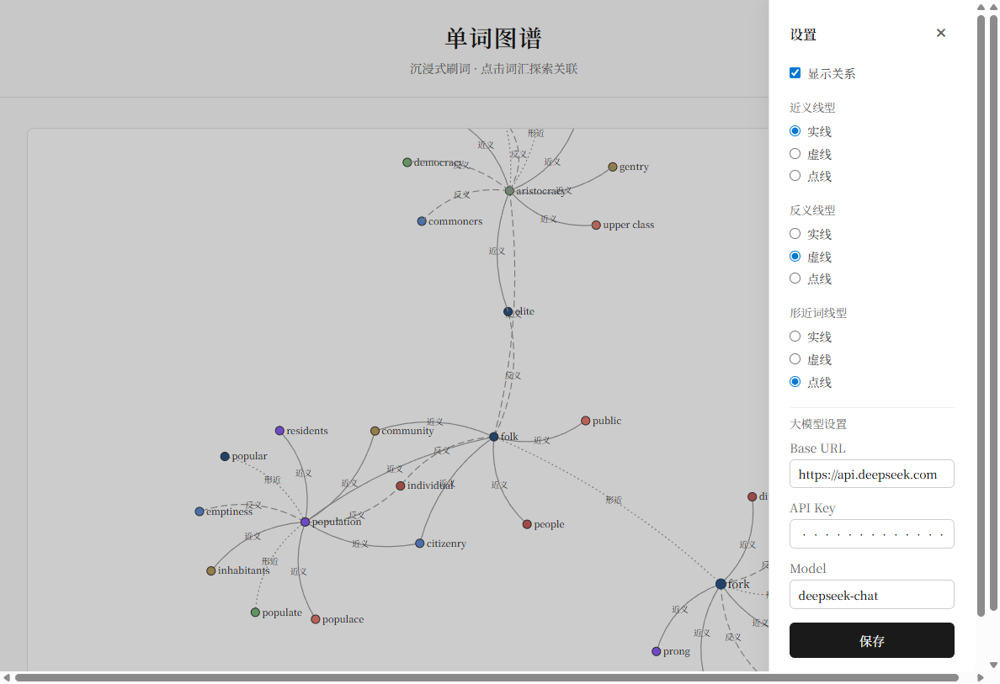
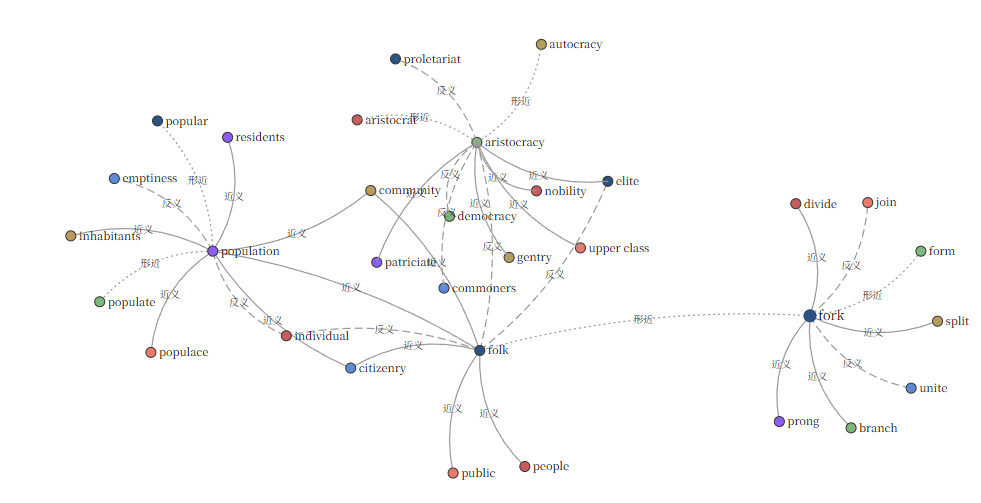

# 单词图谱, 随机背单词，沉浸式刷词

输入或随机一个单词，由 AI 生成近义词、反义词、形近词，并用 D3 图谱展示；点击节点可继续展开该词的关系。
原理是先本地检索，未检索到就使用大模型获取这个词的近义词、反义词、形近词，使用前要配置一下大模型。

## 效果预览





## 快速启动

### 1. 后端

先修改llm_config.json 或启动后在设置里修改

```bash
cd backend
pip install -r requirements.txt
python app.py
```
### 2. 前端

```bash
cd frontend
npm install
npm run dev
```

前端默认运行在 `http://localhost:5173`，已配置代理将 `/api` 转发到后端。

### 3. 使用

- 在输入框输入英文单词，点击「生成图谱」；或点击「随机一词」。
- 图谱中节点为单词，边颜色表示关系类型（绿=近义词，红=反义词，黄=形近词）。
- 点击任意单词节点，会请求该词的关系并追加到图中，实现沉浸式扩展刷词。